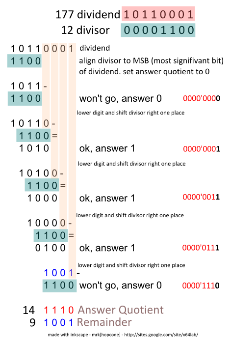

# 01 : Standard IO and Basic Operations

## Contents

* โครงสร้างอย่างง่ายของโปรแกรมภาษาซี
  + Structured programming
    - โปรแกรมย่อย (subprogram) หรือ โมดุล (module) == เราจะเรียนในเรื่อง function
    - sequential 
    - conditional 
    - loop 
  + #include
  + int main()
  + return 0;

* Standard Input
  + #include <stdio.h>
  + prinf("Hello, World!")
  + Escape character 
    (ภาษาไทย เรามักจะเรียกว่า อักขระพิเศษ)
  + \r\n - ปัดแคร่ + ขึ้นบนทัดใหม้
  + \t - tab
  + \\\\
  + \\'
  + \\"

* Variable Declarations + Data type + output formating
 
  + ภาษาซี ประกาศบนสุดเสมอ
  + int
  + int : printf(%d)
  + char
  + char : printf(%c)
  + unsigned int
  + unsigned char
  + char[]
  + char[] : printf(%s)
  + float 
  + float : printf(%f)
  + double
  + double : printf(%lf)

* Standard Output: scanf()
  + Main Memory & Address
    - cache memory
    - RAM
  + "address of" (&) operator
  + printf(%p, <address>)
  + scanf(%d, int)
  + scanf(%f, float)
  + scanf(%lf, double)
  + scanf(%c, char)
  + scanf(%s, &string)

* Basic Operation
  + = 
  + +
  + - 
    - Ones' complement
    - Two's complement
  + *
    - bitwise operators == shift bit left
    - shift left 1 เท่ากับ คูณสองโดยธรรมชาติ
  + /
    - bitwise operators == shift bit right 
      
  + %
  + ()
  + ลำดับความสำคัญของ Operator
    

## TASK

  * 0001 : A + B Problem

