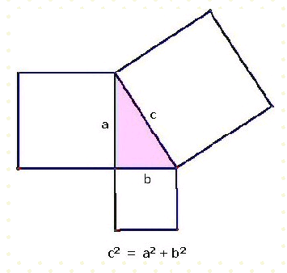

**0005 : Pythagorus**
**Problem type :** Batch
**Time limit :** 1.0 second(s)
**Memory limit :** 64 megabyte(s)

รูปสามเหลี่ยมมุมฉาก (right, rectangled) มีมุมภายในมุมหนึ่งมีขนาด 90° (มุมฉาก) 
ด้านที่อยู่ตรงข้ามกับมุมฉากเรียกว่า ด้านตรงข้ามมุมฉาก ซึ่งเป็นด้านที่ยาวที่สุดในรูปสามเหลี่ยม 
อีกสองด้านเรียกว่า ด้านประกอบมุมฉาก

มีทฤษฎีที่เกียวข้องกับสามเหลี่ยมมุมฉาก ทฤษฎีนั้นคือ ทฤษฎีบทพีทาโกรัส กล่าวไว้ว่า 
"ผลรวมของพื้นที่ของรูปสี่เหลี่ยมจัตุรัสบนด้านประชิดมุมฉากทั้งสอง จะเท่ากับ 
พื้นที่ของรูปสี่เหลี่ยมจัตุรัสบนด้านตรงข้ามมุมฉาก"



#### โจทย์  
จงคำนวณความยาวของด้านตรงข้ามมุมฉาก เมื่อระบุความยาวของด้านประกอบมุมฉากทั้งสองด้านมาให้

#### ข้อมูลนำเข้า  
บรรทัดแรก ประกอบไปด้วยจำนวนจริงบวก 2 จำนวน คั่นด้วยช่องว่าง 1 ช่อง แต่ละจำนวนจะบ่งบอกถึงความยาวของด้านประกอบมุมฉากของรูปสามเหลี่ยมรูปหนึ่ง

#### ข้อมูลส่งออก  
บรรทัดแรกเพียงบรรทัดเดียว แสดงความยาวของด้านตรงข้ามมุมฉากของรูปสามเหลี่ยมมุมฉากที่มีด้านประกอบมุมฉากที่มีความยาวเท่ากับที่ระบุไว้ในข้อมูลนำเข้า ตอบเป็นทศนิยม 6 ตำแหน่ง

#### ที่มา: 
Programming.in.th (Northern_series)

#### ตัวอย่างข้อมูลนำเข้า
```
3.000000 4.00000	
```

#### ตัวอย่างข้อมูลส่งออก
```
5.000000
```

#### คำใบ้
ภาษาซีได้เตรียม library 
เกี่ยวกับคณิตศาสตร์ไว้ให้จำนวนหนึ่งใน math.h 

การหารากที่สอง ทำได้โดยใช้ function sqrt()

```
#include <stdio.h>
#include <math.h>

int main () {
  double x, result;
  scanf("%lf", &x);
  result = sqrt(x);
  printf("%lf\n", result);
  return 0;
}
```

จาก source code ตัวอย่าง sqrt() รับ parameter เป็นข้อมูลชนิด double 
และแสดงตัวอย่างการรับข้อมูลชนิด double ด้วย scanf
